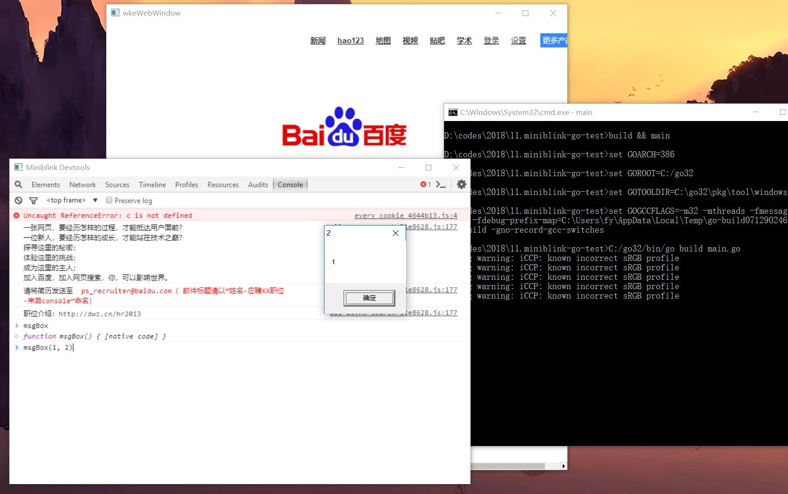

# miniblink-go-example

此为 [miniblink](https://github.com/weolar/miniblink49) 项目的 golang 绑定示例。

### 环境：
golang 32位版本（受限于目前miniblink仅有32位版）

gcc 这里推荐 tdm-gcc

### 使用步骤：
1. clone 代码至本地
2. 找一个 miniblink 的二进制来，文件名通常为 node.dll
3. 编译
    1. 如果32位go是你唯一的go环境，那么直接运行 `go build main.go` 即可  
    2. 如果不是，那么修改 build.cmd 将其中的参数指向你的32位 go 环境
4. 执行得到的 exe

### 其他：
如有问题，请更新 wkedefine.h

许可协议：Apache 2.0（任意用途可用，但修改和使用需要带上原版权信息）
